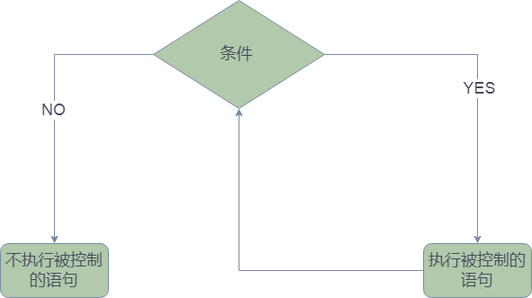

# 循环

假如我们想输出 `1->5`之间的所有的数字，那可以这样写代码 

```python
print(1)
print(2)
print(3)
print(4)
print(5)
```

那如果要输出 `1->100`呢？写100百行代码吗？

显然我们要找到一种方式来解决这种重复的劳动，代码如下


```python
i=1
while i<=100:
	print(i)
	i=i+1
```


## while循环执行的过程 




## while的写法

```plaintext
while 判断条件(condition)：
    执行语句(statements)……
```

从1数到10

```plaintext
count = 1
while (count <=10):
    print("count",count)
    count = count + 1
```


## 参考

[Python While 循环语句 | 菜鸟教程](https://www.runoob.com/python/python-while-loop.html)
