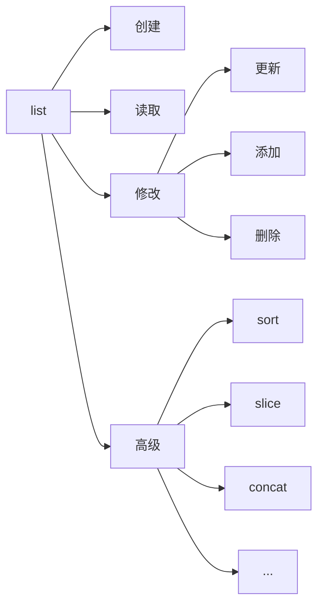

# 列表 list



列表是 Python 中最基本的数据结构

一些概念
- 列表: 就是可以按顺序去存各种类型元素的数据结构,简单的说就是被 `[]`包起来的数据，可以为空。
- 索引：就是下标 

列表，列表示**队伍**，表表示对应关系，例如 a[0] 对应第一个数据

## 创建list

创建一个列表，只要把逗号分隔的不同的数据项使用方括号括起来即可

```py
a = [1,2,3,4,5]  #创建一个list，并赋值给变量a
print(a) # 输出整个list
print(a[0])# 输出第1个元素
print(a[1])# 输出第2个元素
print(a[2])# 输出第3个元素
print(a[3])# 输出第4个元素
print(a[4])# 输出第5个元素
```

list中的元素类型甚至可以不同

```python3
# 含有字符串和整数
list1 = ['Google', 'Runoob', 1997, 2000]

# 整数
list2 = [1, 2, 3, 4, 5 ]

# 字符串
list3 = ["a", "b", "c", "d"]

# 字符串
list4 = ['red', 'green', 'blue', 'yellow', 'white', 'black']
```

## 获取list中的值

我们可以通过**索引（下标）**来获取对应的元素，

索

```python3
list = ['red', 'green', 'blue', 'yellow', 'white', 'black']
print( list[0] ) #  获取第一个元素 'red'
print( list[1] ) #  获取第二个元素 'red'
print( list[2] ) #  获取第三个元素 'red'

#索引也可以从尾部开始，最后一个元素的索引为 -1，往前一位为 -2，以此类推。
print( list[-1] )
print( list[-2] )
print( list[-3] )
```

## 修改与添加

列表的数据项进行修改或更新，你也可以使用 append() 方法来添加列表项

如何修改已经存在的列表中的某个值
```python3
a = [1,2,3,4,5] # 创建一个列表
print(a) # 输出整个列表

# 想要修改列表的第2个元素为100
a[1] = 100
print(a) # 查看是否修改
```

```python3
a = [1,2,3,4,5] # 创建一个列表
print(a) # 输出整个列表

# 想要在列表的末尾添加一个100
a.append(100) # a去append100
print(a) # 查看是否添加
```


## 迭代列表

如何一个接一个去访问列表的元素

```python
a = [1,2,3,4,5]
for i in a:
    print(i)
```
输出结果为

```
1
2
3
4
```
列表a中的每个元素输出了一遍.原理是i会依次变成a的值


## 列表的更多操作

- 拼接
- 重复
- 切片

## 嵌套列表

TODO

基本考不到，不讲

## 列表中的函数与方法

TODO

## 在list中使用 for

```python3
l = [1,2,3,4,5] # 定义一个list

for x in l: # 这句话的意思是依次遍历l的元素,x依次变成l中元素
    print(x)

#等价于
i = 0
while i < 5:
    x = l[i]
    print(x)
    i=i+1
```

## 题目


