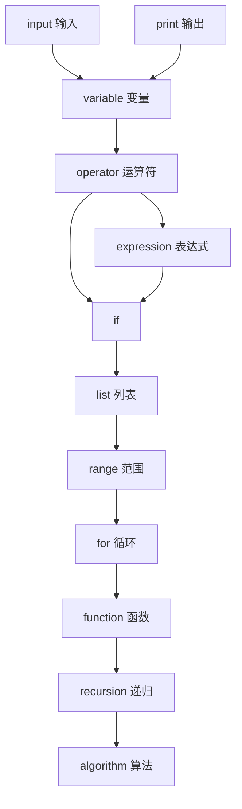

# PythonBook

这里是我写的python3学习书

## 学习方式

根据我多年的学习经验，所有的学习本质上都是对新**名词**的学习.

所以在我写得这个python3教程下，重点就是给同学们讲解这些python3的**新名词**，能让你**理解并掌握**这些新名词是我的目的，最后使你可以把些名词代表的概念组合起来解决问题。

对于每个名词，我将会尽可能的用最简短的一句话来解释！
   
- print 输出
- input 输入
- variable 变量，是一个箱子  ，a = 123
- operator 运算符
- expression 表达式,任何表达式都会返回值
- list 列表
- range 范围
- for 循环

## 学习路径

## 有用的网站

[Python3 教程 | 菜鸟教程](https://www.runoob.com/python3/)

## 在线编写python

https://py3.codeskulptor.org/
https://c.runoob.com/compile/9/
https://ideone.com/

https://www.online-ide.com/

https://replit.com/ 很好 需要注册

https://www.anycodes.cn/editor 国内

## 有用的工具

- []

## 作者